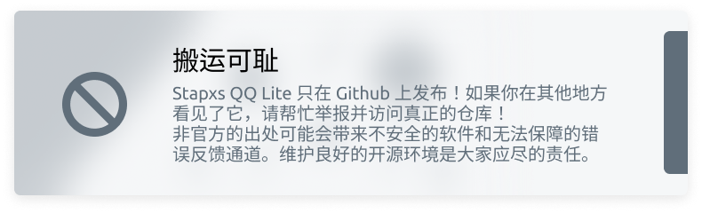

<p align="center">
    
    <h2 align="center" style="font-weight: 600">Stapxs QQ Lite X</h2>
    <p align="center">
        
    </p>
    <p align="center">
        一个跨协议的 <a href="https://github.com/Stapxs/Stapxs-QQ-Lite-2.0">Stapxs QQ Lite</a> 发行版
        <br />
        <a href="http://qqlite.leenet.xyz/test" target="blank"><strong>🌎 访问 DEMO</strong></a>  |
        <a href="https://github.com/Chzxxuanzheng/Stapxs-QQ-Lite-X/issues/new?template=bug-report.yml&assignees=Chzxxuanzheng&labels=%3Abug%3A+%E9%94%99%E8%AF%AF&title=%5B%E9%94%99%E8%AF%AF%5D" target="blank"><strong>💬 反馈问题</strong></a>
        <br />
        <br />
        <strong>本网页应用仅供学习交流使用，请勿用于其他用途</strong><br>
        <strong>版权争议请提出 issue 协商</strong>
    </p>
</p>

---

该项目正在开发，您可以通过[访问Demo](http://qqlite.leenet.xyz/test)来使用测试版网页。如果您想部署，可以参考下面的构建应用

## 📦️ 构建应用

为了规范对其他仓库的引用，Stapxs QQ Lite X 仓库含有一些子模块，这意味着你需要在克隆仓库的时候包含子模块：

```bash
git clone https://github.com/Chzxxuanzheng/Stapxs-QQ-Lite-X --recursive
```

如果你已经克隆了仓库，也可以使用这个来补全子模块：

```bash
git submodule update --init
```

在开始构建之前请安装依赖，请确保安装了 `yarn`：

```bash
# 安装依赖
yarn install
```

最后，在构建前 Stapxs QQ Lite X 使用了高德地图的部分 API 来显示位置共享的地图。在 `.env` 文件中提供了一个默认的高德地图 API Key，如果你打算自行部署，你可以在 [这里](https://lbs.amap.com/dev/key/app) 申请一个属于你自己的 API Key 并替换掉默认的 API Key。

我们非常建议你使用自己的 API Key，因为默认的 API Key 有使用次数限制。

### > 构建 Web 页面

Stapxs QQ Lite X 是一个基于 Vue 的单页应用，这意味着如果你想自行部署到网页服务需要进行构建。

下面是构建该项目的命令，构建结果将最终输出在 `dist` 目录下：

```bash
# 运行本地调试
yarn dev

# 代码检查和自动格式化
yarn lint

# 构建应用
yarn build
```

### > 构建 Electron 客户端

在 `2.3.0` 版本后，Stapxs QQ Lite X 支持构建为 Electron 应用并补充部分平台特性的功能，你也可以自行构建。

> 如果 Electron CLI 无法找到 Python bin，你可以将 `PYTHON_PATH` 导出到环境变量中，指向 Python 的可执行文件路径。

下面是构建 Electron 应用的命令，构建结果将最终输出在 `dist_electron/out` 目录下：

```bash
# electron 运行本地调试
yarn dev:electron

# electron 构建应用
yarn build:win
```

### > 构建 Capacitor 应用

在 `3.0.0` 版本及以后，Stapxs QQ Lite X 支持通过 Capacitor 构建为移动端应用并补充部分平台特性的功能，你也可以自行构建。

#### Android

> 如果 Capacitor CLI 无法寻找到 Android Studio 以及 Android SDK，你可以将 `CAPACITOR_ANDROID_STUDIO_PATH` 和 `ANDROID_HOME` 导出到环境变量中；
> 它们分别指向 Android Studio 的可执行文件路径和 Android SDK 的路径。

你可以使用 `yarn open:android` 来打开 Android Studio。通过 Build -> Generate Signed Bundle or APK 来构建 APK 文件。

你也可以直接使用 `yarn build:android` 来构建 APK 文件。请检查修改 `capacitor.config.ts` 文件中的 `android.buildOptions` 中的 keyStore 配置。

构建结果将最终输出在 `src/mobile/android/app/build/outputs/apk/release` 目录下。

#### iOS

你可以使用 `yarn open:ios` 来打开 Xcode。通过 Product -> Archive 来构建 IPA 文件。

你也可以直接使用 `yarn build:ios` 来构建 IPA 文件。此构建方式将执行 `scripts/build-export-ipa.sh` 脚本，构建将使用钥匙串中的默认开发者证书，请确保你的开发者证书已经配置。

XCode 的构建结果将最终输出在 `src/mobile/ios/build` 目录下，脚本构建结果将输出在 `dist_capacitor` 目录下。

### > 命令列表

这儿是本项目的完整命令列表，你可以使用这些命令来快速构建和调试 Stapxs QQ Lite。

**命令格式为 `yarn <命令>`，其中 `<命令>`为列表中的一个：**

| 命令           | 描述                         |
| -------------- | ---------------------------- |
| install        | 安装依赖                     |
| lint           | 代码检查和自动格式化         |
| update:icon    | 更新移动端应用图标集         |
| update:version | 更新移动端应用版本号         |
| dev            | 网页调试                     |
| dev:electron   | Electron 调试                |
| dev:ios        | iOS 调试                     |
| dev:android    | 安卓调试                     |
| open:ios       | 在 XCode 中打开项目          |
| open:android   | 在 Android Studio 中打开项目 |
| build          | 网页构建                     |
| build:electron | 构建当前平台的应用           |
| build:ios      | 构建 iOS 应用                |
| build:android  | 构建 Android 应用            |
| proxy          | 一个临时跨域代理服务器       |

## 📜 额外依赖声明

Stapxs QQ Lite 使用了 [DeltaChat](https://github.com/deltachat/deltachat-desktop) 的 user-notify crate，这是个 Rust 通知库，提供了完善的跨平台通知功能。由于它未提供可用的 cargo 包，因此其源码被复制到本项目的 `src/tauri/crates/user-notify` 目录下。此部分代码已通过 .gitattributes 文件将其排除在代码统计之外。

## 🎉 鸣谢

感谢 Stapxs 提供上游项目，使本发行版得以开发
感谢 Shigure 为本项目提供了图标设计

<a href="https://github.com/Stapxs">
    
</a>

